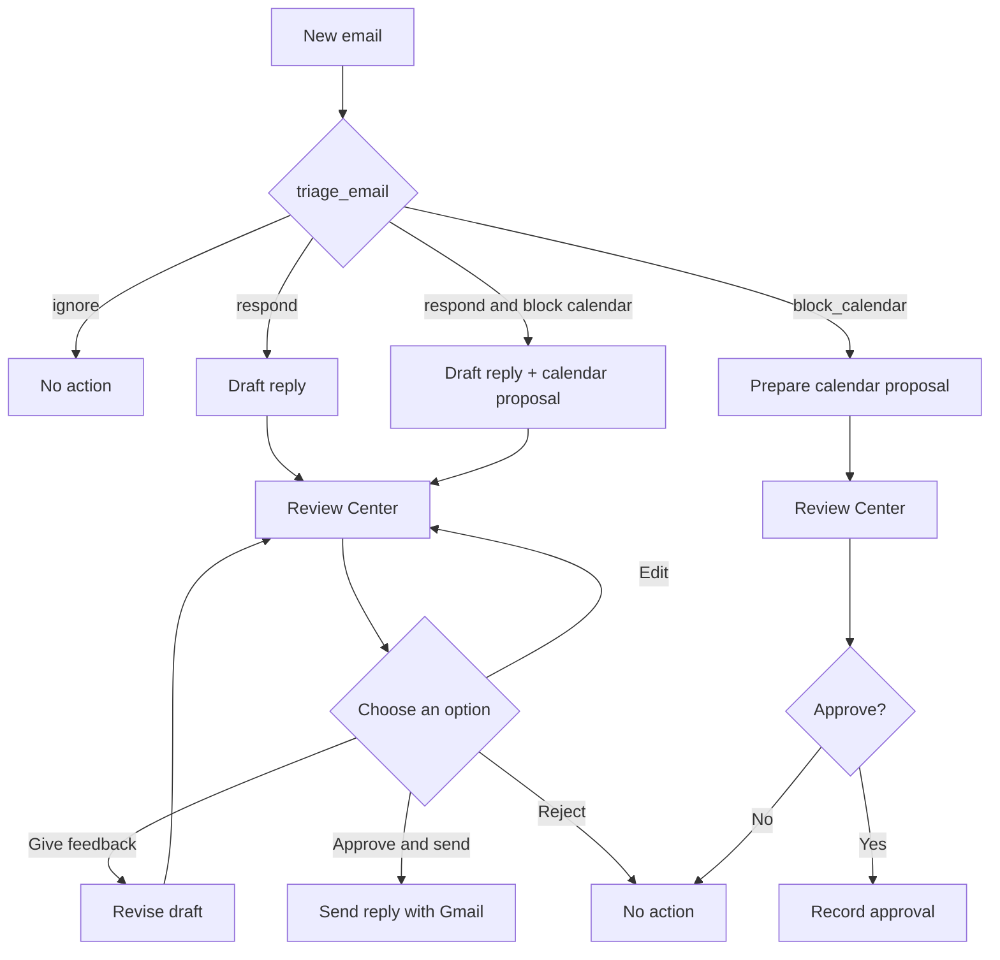

# InboxPilot

InboxPilot is a Gmail-connected ambient email assistant built with LangGraph, LangChain, and Mem0.

It is designed to:
- ingest inbox messages from Gmail
- triage and prioritize email
- draft and review replies with human approval
- remember user preferences over time
- work with Nebius-hosted inference via a compatible OpenAI-style API

## Project goal

Build a production-ready personal email agent that can act as an assistant for inbox triage, drafting, scheduling, and memory-aware follow-up without repeating the same preferences each time.

## Development decisions

### Triage uses structured output

The first LangGraph node, `triage_email`, must return a structured decision rather than free-form prose. Its response is validated as a JSON object with these fields:

```json
{
  "intent": "ignore | respond | block_calendar",
  "reasoning": "...",
  "requires_review": true,
  "question": "...",
  "calendar_event": {
    "summary": "...",
    "start": "ISO-8601",
    "end": "ISO-8601",
    "timezone": "...",
    "description": "..."
  }
}
```

This contract is important because the next graph step routes the email based on `intent`. During live testing, the Nebius model initially returned a natural-language explanation instead of JSON. The triage prompt now explicitly requests JSON only, and the parser can extract a valid JSON object if the model wraps it in markdown or surrounding text. Responses without a valid decision fail clearly instead of being routed unpredictably.

The scoped design uses three intents: `ignore`, `respond`, and `block_calendar`. `review` is not an intent; it is an approval state. `respond` and `block_calendar` always require human review before an email is sent or the calendar is changed. Incoming conversational messages from another person, including personal messages, are response candidates and should not be automatically ignored. A message sent by the user to their own address may be ignored unless it requests an action. For a personal response candidate, triage selects `respond`, drafts a reply, and asks the user to approve it.

The graph currently follows this limited flow:



The graph also supports `respond_and_block_calendar` when one email requires both a reply and a calendar reservation. It creates both artifacts and presents them in one Review Center approval. The Review Center is the Human in the Loop (HITL) layer. It uses a LangGraph interrupt to pause at the approval boundary and resumes with an edit, feedback revision, approval, or rejection. Each review surfaces the email sender and subject, the agent's intent, and the agent's reasoning before asking for a decision. The current CLI and FastAPI UI are Review Center adapters. Approved response drafts are sent through Gmail, and approved calendar proposals create events through Google Calendar. Combined approval executes both actions.

Calendar access uses the OAuth token stored at `GMAIL_TOKEN_PATH`. The Calendar client supports calendar listing, event listing, free/busy lookup, event creation, update, and deletion. If the existing token was created before the Calendar read scopes were added, rerun the OAuth setup once:

```powershell
.venv\Scripts\python.exe scripts\setup_gmail_oauth.py
```

Approve the Gmail send plus Calendar permissions in the browser. This is required before the application can read availability or create an approved event.

### Review Center UI

The local Review Center UI is served by FastAPI. Start it with:

```powershell
.venv\Scripts\python.exe -m inboxpilot.web
```

Then open `http://127.0.0.1:8000`. The UI uses `GMAIL_EMAIL` from the local `.env` and does not ask the user to enter an email address. Select **Inspect my new primary emails** to show up to the five newest matching Primary emails from the default two-day window, with each agent intent, reasoning, and draft or proposed calendar action before allowing approval or rejection. An email address can still be supplied as an API query override when needed.

For response reviews, edit the draft directly or enter feedback and choose **Revise with feedback**. When the final text is ready, choose **Approve and send**. This sends the reply through Gmail; it does not apply to calendar proposals. Because sending requires the `gmail.send` OAuth scope, rerun the OAuth setup after this scope is added and approve the updated permission request.

This UI is intentionally limited to the graph in this README. Calendar proposals are created only after explicit approval and do not add additional action types.

### Mem0 memory schema

Mem0 stores durable, user-scoped preferences learned from Review Center feedback. The application sends the feedback as a user message and uses the following simplified categories:

`response` for reply style and content, `triage` for how messages should be classified, and `calendar` for scheduling preferences.

```json
{
  "user_id": "sneha.joseph89@gmail.com",
  "memory": "Keep replies warm and concise.",
  "metadata": {
    "category": "response",
    "intent": "respond",
    "source": "review_center"
  }
}
```

The Mem0 `user_id` is applied as a search and storage filter so one user's preferences are not mixed with another user's memories. During triage and drafting, the agent retrieves up to five relevant memories and includes them in the prompt. Review Center includes a read-only **My saved preferences** view backed by `/api/memories`. When Mem0 is not configured, a process-local fallback is used for development only and is not durable across restarts.

Feedback is saved automatically when the user enters it in the Review Center and selects either **Approve and send** or **Revise with feedback**; it does not need to be entered into Mem0 manually. This works for reply drafts, combined actions, and calendar-only proposals. **Approve and send** uses any manually edited reply, saves the preference for future actions, and executes the approved action. **Revise with feedback** saves the preference and asks the model to update the current reply or calendar proposal before returning it for another review.

Before storage, a dedicated LLM classification step extracts every durable preference from the feedback and assigns each preference independently to `response`, `calendar`, or `triage`. It does not use the current action's intent as the preference category. This allows one feedback submission to contain multiple preferences: for example, omitting a phone number is stored as a response preference while preferring Saturday evening meetings is stored separately as a calendar preference. One-time instructions for the current recipient, draft, or event are used for revision but are not intended to become durable memories.

#### Feedback memory uses semantic classification

Preference categorization is intentionally separate from the intent of the email being reviewed. A combined reply-and-calendar review can contain feedback about several unrelated concerns, so assigning the entire feedback block to `calendar` or `response` based on the current graph route is incorrect. For example, "Do not include my phone number in replies" remains a response preference even when it is submitted while reviewing a calendar proposal.

The classifier therefore performs three tasks before Mem0 storage:

- extracts multiple durable preferences from one feedback submission
- assigns each extracted preference independently to `response`, `calendar`, or `triage`
- excludes one-time instructions that should affect only the current revision, such as asking a particular sender a question

Each classified preference is stored as a separate Mem0 record with its own category metadata. The classifier must return validated JSON; if classification fails, the review action fails clearly instead of storing the feedback under an assumed category. This additional LLM step adds latency, but prevents intent-based category leakage and produces memories that can be retrieved in the correct future context.

For a combined reply and calendar action, revision feedback updates both artifacts. For example, if the sender asks to meet and the user says they prefer Saturday afternoon and wants to ask which time the sender prefers, InboxPilot saves that feedback as a calendar preference, revises the reply to ask the sender, and revises the proposed calendar hold to the user's preferred slot. Both actions remain pending until the user explicitly approves them.

If `MEM0_API_KEY` is missing, or if a Mem0 request fails, the application silently falls back to process-local memory. Preferences shown under **My saved preferences** may therefore come from this temporary fallback and are not, by themselves, proof that Mem0 persisted the data. Process-local preferences are lost when the application restarts. Durable storage should be verified using the configured Mem0 account when persistence matters.

### Implementation scope guardrails

Use the graph above as the implementation contract for the current phase:

- Keep the four scoped triage intents: `ignore`, `respond`, `block_calendar`, and `respond_and_block_calendar`.
- Treat human review as an approval state, not as a fourth intent.
- Keep the `respond` path limited to drafting, editing, revising with feedback, and explicitly approving a reply for Gmail sending.
- Keep the `block_calendar` path limited to preparing a proposed calendar action and requesting approval.
- Keep the `respond_and_block_calendar` path as one combined review containing both the reply draft and calendar proposal.
- Do not add automatic email sending without explicit approval, calendar changes, extra action types, or unrelated UI workflows until this graph is complete and explicitly expanded.
- Any future change to the graph, intent schema, or approval boundary should update this diagram and the tests in the same change.

## Tech stack

- Python
- LangChain
- LangGraph
- Mem0
- Google Gmail API
- Nebius model inference

## Suggested structure

- src/inboxpilot/
  - agent.py
  - config.py
  - gmail_client.py
  - memory.py
  - tools.py
- tests/
- .env.example
- .gitignore
- pyproject.toml

## Quick start

1. Create a virtual environment.
2. Install dependencies with pip or uv.
3. Copy .env.example to .env and fill in your keys.
4. Start a local LangGraph dev server.
5. Run the Gmail ingestion flow.

## GitHub-ready setup

This project is structured as a clean repository root so it can be pushed to GitHub directly.

## License

MIT
